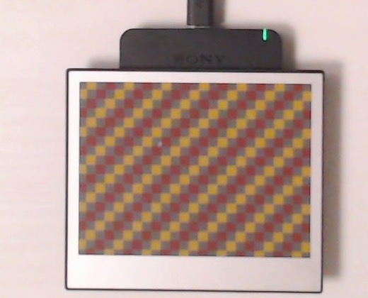
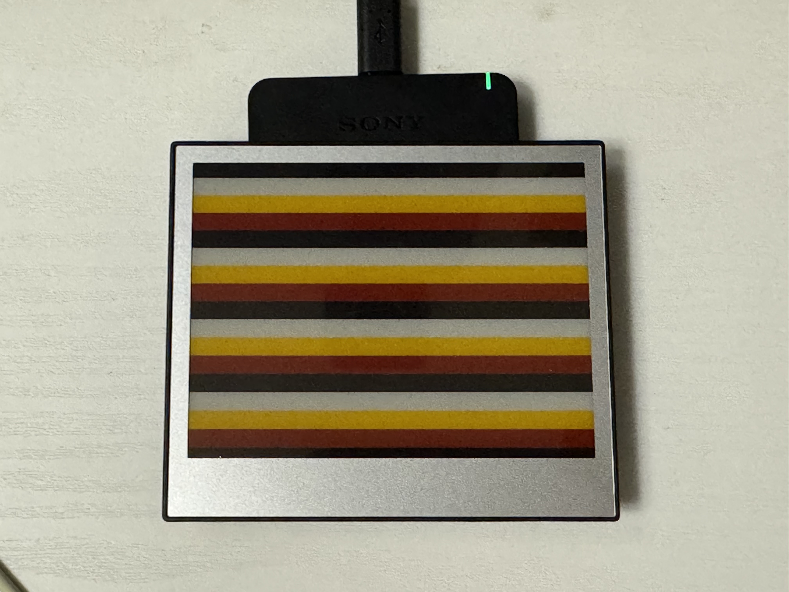
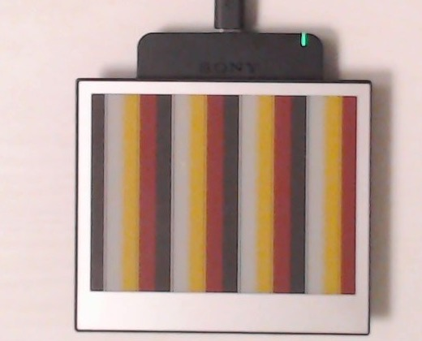

# ez-sign-nfc-go

EZ-Sign NFC 電子ペーパー向けの Go ライブラリです。

- `github.com/ebfe/scard` で PC/SC 通信
- 4 製品バリエーション対応
  - `2.9-2c` (296x128, 2色)
  - `2.9-4c` (296x128, 4色)
  - `4.2-2c` (400x300, 2色)
  - `4.2-4c` (400x300, 4色)
- 書き込み API は2種類
  - `WriteImage`: 任意画像を量子化/エンコードして書き込み
  - `WritePixels`: 画素インデックスを直接書き込み

## Install

```bash
go get github.com/hrntknr/ez-sign-nfc-go
```

## Library Usage

```go
dev, err := ezsignnfc.Open(ezsignnfc.Product42Quad) // 先頭reader
if err != nil {
    panic(err)
}
defer dev.Close()

imgFile, _ := os.Open("input.png")
img, _, _ := image.Decode(imgFile)

if err := dev.WriteImage(context.Background(), img); err != nil {
    panic(err)
}
```

reader一覧の取得と明示指定:

```go
readers, err := ezsignnfc.ListReaders()
if err != nil {
    panic(err)
}
fmt.Println(readers)

dev0, _ := ezsignnfc.Open(ezsignnfc.Product42Quad, ezsignnfc.ReaderIndex(0))
defer dev0.Close()

devByName, _ := ezsignnfc.Open(ezsignnfc.Product42Quad, ezsignnfc.ReaderName("SONY FeliCa Port/PaSoRi 4.0"))
defer devByName.Close()
```

`WritePixels` のピクセルは行優先 (`y * width + x`) のインデックス配列です。

- 2色: `0=black`, `1=white`
- 4色: `0=black`, `1=white`, `2=yellow`, `3=red`

## Example CLI

`example/cmd/ezsigncli` に CLI を同梱しています。

### 画像を書き込む

```bash
go run ./example/cmd/ezsigncli \
  -mode image \
  -product 4.2-4c \
  -input ./sample.png \
  -crop 100,80,800,600 \
  -dither
```

### ランダム画素を書き込む

```bash
go run ./example/cmd/ezsigncli \
  -mode random \
  -product 2.9-2c
```

### テストパターンを書き込む

`-mode` には以下を指定できます。

- `checker`
- `hstripe`
- `vstripe`

```bash
go run ./example/cmd/ezsigncli \
  -mode checker \
  -product 4.2-4c
```

<p align="center">
  
  
  
</p>
